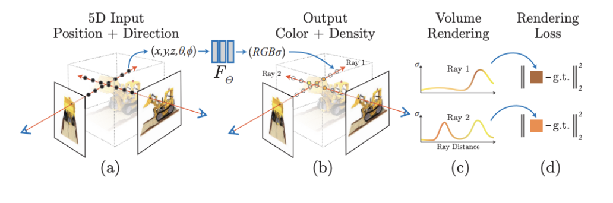
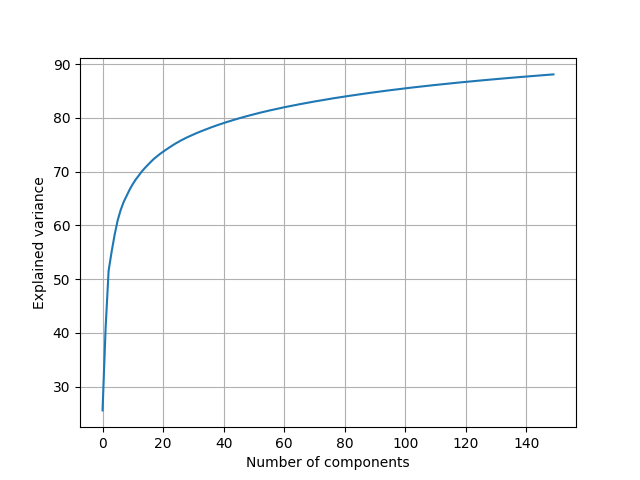
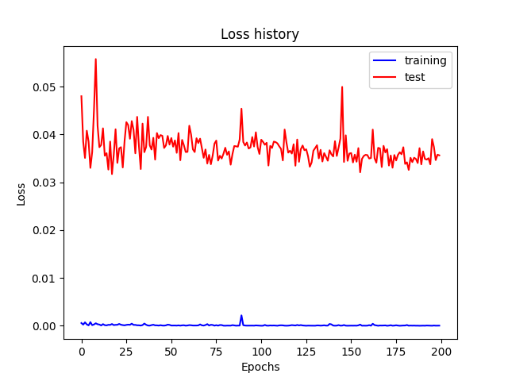
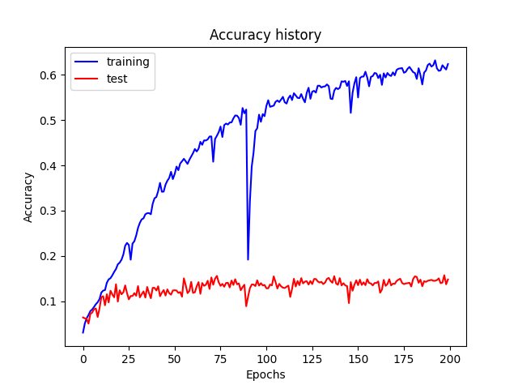
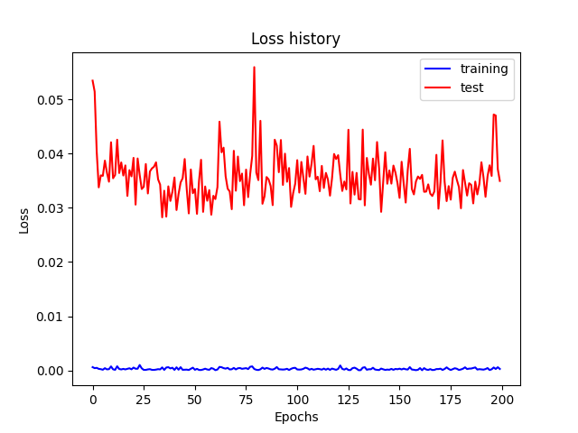
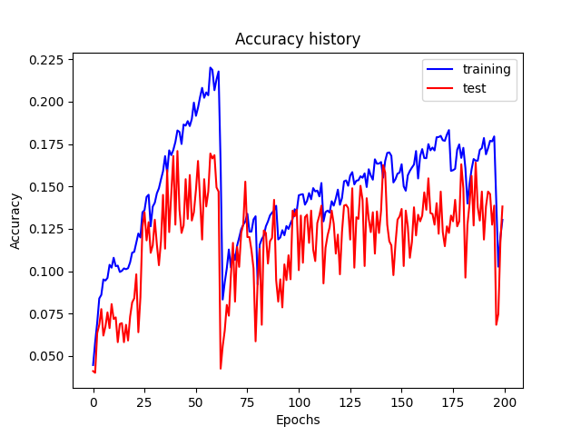
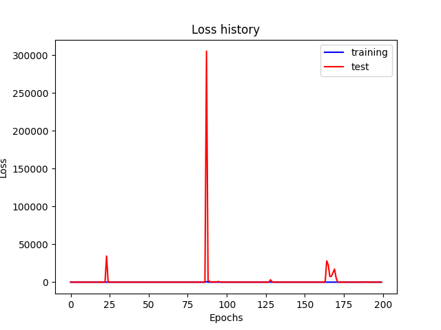
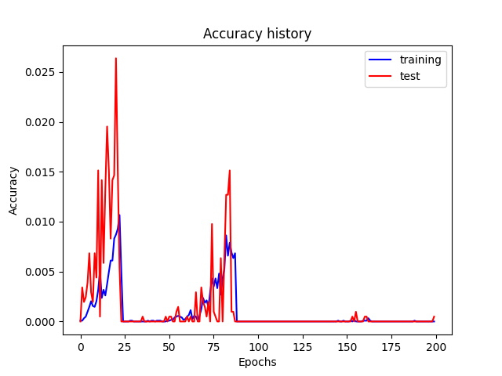

# Introduction

Since the introduction of Neural Radiance Fields (NeRF) in 2020, there has been an explosion of interest in neural implicit representations for capturing 3D geometry. While the majority of research in this area has explored problems specific to the computer vision and computer graphics communities, applications within robotics have been less explored. The application we are particularly interested in is performing localization/loop closure within a NeRF. Specifically, works have tried estimating the location of where an image was taken in the scene using a NeRF. Many related works have achieved this by either 

A) incorporating extra source(s) of information beyond a NeRF [[5]](#5)

B) modifying the NeRF training process [[6]](#6) [[7]](#7)

C) assuming that there is some initial estimate of the image pose. [[4]](#4)

Another relevant method which we will be using is PCA, or Principal Component Analysis. This method will be used to help conduct dimensionality reduction on the images, in order to better organize.

Also for reference, we will be generating our own dataset of a room to train a NeRF. There are open source and 3rd party apps that, using an iphone, can help us generate high quality 3D reconstructions of a room. The details of this are described in the pivots section.

*Check out our Video on [YouTube](https://www.youtube.com/watch?v=DzJmq3BfxOc&feature=youtu.be)*

# Problem Definition

Assume we have a blackboxed NeRF pre-trained on a specific scene. Given a new RGB image taken within the scene, predict what was the position and viewing direction the image was taken from, using only the pretrained NeRF model as the source of information.

# Problem Motivation

These were some questions we asked in pursuit of solving this problem:
1. Can a NeRF be reversed in its function? (Understanding the limitations of this new model)
2. What type of data can be processed? (Submitting more messy data to understand how strong models are)
3. What level of classification strength can we reach?

# NeRF Background

Image Taken from “NeRF: Representing Scenes as Neural Radiance Fields for View Synthesis.” 

NeRFs address the problem of novel view synthesis using a MLP that inputs 3D location and 2D viewing direction to approximate the continuous radiance field in the scene, which outputs color and volume density. [[1]](#1)

# VAE Background

VAEs are generative models that work to encode and decode data to create novel data. The VAE will first take in the data and create a distribution utilizing parameters in a latent space. From this distribution, the decoder will reconstruct the original data. To ensure similarity with the original data, VAEs have a regularization term (ensuring the latent space is continuous/well-structured) and a reconstruction loss (checking that the samples match the original data). [[2]](#2)

# PCA Background
PCA or Principal Component Analysis is used to reduce the dimensionality of large datasets while minimizing the amount of information lost by creating uncorrelated variables to maximize variance. Apart from being one of the most common methods of dimensionality reduction, PCA is also increasingly adaptive to different problems and applications. Using this algorithm, we will be able to reduce the dimensionality of our NeRF output while maintaining the maximum necessary variance to properly train the model. This reduced data will be fed into the supervised learning gradient descent model to garner the final pose output. [[8]](#8)

# MLP Background
MLP or Multilayer Perceptron is a feedforward neural network composed of input, hidden, and output layers. They are one of the most commonly used neural networks and are often paired with a backpropagation algorithm to be used in a variety of applications. With this model, we will be able to take in the reduced data from the PCA and output pose predictions or estimations to determine the position and angle of a certain RGB image. We use MLPs because they are universal approximators, and in theory are expressive enough to learn to estimate the pose an image was taken from. [[11]](#11)

# CNN Background
CNN or Convolutional Neural Network is another model we will use in comparison to MLPs for performing our pose prediction task. In practice, MLPs fail to learn on images after a certain level of complexity within the images. CNNs don't face this issue due to their inductive bias for images. [[12]](#12)

# Method

Below was our original plan for the methodology:

We will generate a massive amount of image/pose paired data using a pre trained NeRF model. Specifically, we will sample various poses using some heuristic to have a varied image dataset extracted from the NeRF. We will use this data to perform a supervised learning task of predicting the pose, given RGB image input. The loss will be a distance metric between estimated and true pose values. The RGB image will first be preprocessed with a VAE, in which this latent representation will be used for the supervised learning task. We plan on using an MLP for predicting the poses. 

Below outlines the method we executed in practice. 

To generate our dataset, we first collect an initial video trajectory taken from an iphone, in which the video trajectory traverses a small apartment room. We split this video into 2000 image frames. Because of special software for the iPhone, we successfully paired pose information with the image frames (For more details on this software, see the data section later in the page). With this dataset, we trained a NeRF model to learn the environment of the small apartment room. After training is completed, we generate a greater quantity of images than 2000. For practical limitations, we stopped at 14000 images. However, a NeRF contains a continuous representation of the scene, so the number of images generated is only limited by the compute limitations. The NeRF model we employed specifically was Nerfacto, which was built on nerfstudio. [[13]](#13)

For creating the data augmentation with the NeRF, we faced many challenges. Once training was completed, there were very apparent artifacts visible in the room. To address this, we tried additional training and also using different datasets, but the issue persisted. Instead, we tried to implement an image sampling strategy that minimizes the number of artifacts present in the images. We sampled new images in close proximity (translation within a threshold) and viewing direction (some variance in rotation across z-axis) to the originally captured images. However, still we qualitatively noticed a non-trivial amount noise/artifacts in the generated images. To show this quantitatively, we evaluate the visual accuracy of the NeRF to reconstruct a test set of images used for training the NeRF. The train and test set of the input data was split 1800 images to 200 images. On the test set the PSNR value varied around about 18 (fluctuates sligthly based on number of training iterations). A search online for what is a good PSNR value shows that 18.0 is not very desirable! Furthermore, we had to implement a hack to generated sampled images because nerfstudio was being quite difficult to generate images in the same manner as the original input data. Because of this, we were only successful in retreiving position labels from the generated images, rotation information was too difficult to extract. When we predict for pose, we only predict for the x, y, z position.

After we finished "curating our dataset", we wanted to apply some unsupervised learning on the dataset before executing the pose prediction learning task. Originally, we were going to use a VAE to learn a latent space representation of the images and train on the encoded images. However, for simplicity and limitations in project scope, we ultimately opted with PCA for learning an unsupervised representation of the dataset. In practice, we set the number of components for PCA to 150, and found that the explained variance was over 88% still (shown in PCA figure), which we thought was suitable enough for our application. We transform the datasetto 150 principal components and then inverse the transformation to get our compressed outputs of the dataset. We then train for pose prediction on this resulting dataset.

We split the dataset into a train and test set, in which 12000 images are for train, 2000 images are for test.

To train for pose prediction we opted for comparing 2 models, one consisting of only MLPs, and another using a CNN based architecture. In hindsight, training an MLP only model on images was quite silly, and this model never successfully fit to the data. We resized the image dataset from the original 960x720 images to the size 192x140, and so we thought that perhaps maybe the MLP only model could still fit the data, but this was not the case. 

For the CNN model architecture, we applied 3 convolutational layers with maxpooling and then 2 fully connected layers for the pose prediction task. We used LeakyReLU activation after each layer and also added dropout and batch normalization in some of the layers.

We also tried comparing results if we trained on the original dataset resolution of 960x720 pixels to see if there was much of an accuracy drop. We change the CNN architecture to address this higher resolution, increasing the size of the convolution kernals, and maxpooling size, along with adding an additional convolution and maxpool layer.

For the loss of the models, we employed MSE loss. We also devise an accuracy measurement. This is the ratio of the number of pose predictions below a distance threshold from the ground truth pose labels. We found the accuracy measurement to be much more interpretable than the loss metric. 

In the visualizations, we show the loss and accuracy trajectories of our models for 200 epochs across the train and test datasets. 

# Contributions

### Proposal 

|***Contributor*** | ***Task***|
| ------------- | ------------- |
|Lasya|Problem Statement, Methods, Gantt Chart|
|Karthik|Introduction, Background, Methods, References, Gantt Chart|
|Jesse|Potential Results/Discussion, Dataset|
|Ish|GitHub Pages, Potential Results/Discussion|

### Midpoint

|***Contributor*** | ***Task***|
| ------------- | ------------- |
|Lasya|Pivots, Background, Organization, References, GitHub Pages|
|Karthik|Pivots, Introduction, Dataset, Organization, GitHub Pages|
|Jesse|Results/Discussion, NeRF Generation|
|Ish|Results/Discussion, NeRF Generation, GitHub Pages|

### Final

|***Contributor*** | ***Task***|
| ------------- | ------------- |
|Lasya|Pivots, Background, Organization, References, GitHub Pages, Presentation, PCA|
|Karthik|Pivots, Introduction, Dataset, Organization, Results, GitHub Pages, Presentation, PCA|
|Jesse|Results, Discussion, NeRF Generation, PCA, MLP, Presentation|
|Ish|Results, Discussion, NeRF Generation|

# Gantt Chart

You can download a copy of the Gantt Chart [here](https://docs.google.com/spreadsheets/d/1UGEUd4c_OVw5zJeUK5n1tPE1hoim6q-tEjGq8RacUsc/edit?usp=sharing).

# Pivots

## *Data* 

As discussed above, we intended to use ScanNet as our dataset of choice, given the extensive information provided through it. However, when looking to use the dataset through GitHub, we realized that although all of the information about the dataset was there, to actually get access, we had to fill out forms and send them over. Filling out these forms and submitting them led to a host of issues, such as unresponsiveness and repeated messages saying we filled it out wrong, so we had to quickly pivot. We considered the following three options:
1. *Using a Hugging Face subset of the ScanNet dataset*

    This would be the easiest option, as we could guarantee that the images were the same. However, all the available datasets that took images from ScanNet were extremely limited in scope, and would have made the project extremely hard to complete, as we did not have 360 degree views available to us. As a result, the generation of images would be severely restricted, and the remainder of our project would be hindered, so we decided against using this.
2. *Using a Polycam dataset*

    Polycam is an application through which users can take pictures of the space around them, and generate 3D renderings of them which can be utilized in computer vision projects like this one. There are many Polycam projects of room scans online which we could have used, and looked into. However, the actual exportation processes were incompatible with our usage of nerfstudio, which blocked us from easily using them.
3. *Generating our own dataset*

    Using an iPhone 13, we record a video on the phone, moving around in a room of one of our apartments. The video is recorded with RGB + the depth information from the LiDAR on the iPhone. We utilize the Record3D [[10]](#10) app to retrieve the paired RGB and depth video footage. We perform one more step using the open source library nerfstudio to process this video data to generate the paired image view + camera pose input data needed to train a NeRF. Following this method, we demonstrate the ease of training a NeRF to fit a 3D representation of the room. Nerfstudio also contains functionality to evaluate the accuracy of the NeRF model fitting to the scene, in which we can use to gauge whether or not the data collection process should be redone. 

## *Data Preprocessing - VAEs*

**Pros** | **Cons**
Generative modeling → new data similar to training data | Computationally intensive
Regularization | Difficult to integrate
Works well with non-linear data as well | Complex training procedure

Originally, for the preprocessing and unsupervised learning step of the process, we wanted to use a VAE to convert the NeRF output to their latent representations before performing a supervised learning task of predicting the pose of a given image; however, after working on the pipeline further we found that employing a VAE would go beyond the time constraints we are given. Because of this, we decided to pivot to utilizing PCA to reduce the data. While PCA doesn’t come with a lot of the benefits we wanted to capitalize on with the VAE including the generative data it produces and the non-linear relationships it can detect, it doesn’t require as much computational power or time to implement and train. Moreover, it can also help reduce the data similar to the VAE and maintains the most important features when processing the NeRF data, so it serves its purpose while also abiding by the necessary constraints.

# Visualizations 
Below are image renderings generated from the NeRF training on the room.

|***Trained NeRF model with orginal image pose overlayed*** | ***Trained NeRF model views***|
| ------------- | ------------- |
 | 
 | 
 | 
 | 

Below are graphs depicting the data output from our PCA, CNN, and MLP algorithms

## PCA

## CNN on 192x144 images

|***Loss*** | ***Accuracy***|
| ------------- | ------------- |
|

## CNN on 960x720 images

|***Loss*** | ***Accuracy***|
| ------------- | ------------- |
|

## MLP on 192x144 images

|***Loss*** | ***Accuracy***|
| ------------- | ------------- |
|

# Results/Discussion

In the visualizations you can see novel scene renderings of the apartment room generated from the NeRF after training on our dataset. Artifacts are clearly visible. And to reiterate from the methods section, to show this quantitatively, we evaluate the visual accuracy of the NeRF to reconstruct a test set of images used for training the NeRF. The train and test set of the input data was split 1800 images to 200 images. On the test set the PSNR value varied around about 18 (fluctuates sligthly based on number of training iterations). We think this value is low and shows that we should repeform the datacolleciton and NeRF training process to achieve a more representative scene for image generation. Having an image dataset where the camera covers every surface in the room completely should help address these artifacts. The initial camera recording did not achieve this we believe. 

We see that compressing the dataset to 150 principal components maintains a variance of 88% as shown in the figure. While all of our models are trained on the compressed images, it would have been interesting to compare the difference in accuracy had we also trained the models on the original images as well. This would let us gauge the effect of the information loss with PCA when doing pose estimation. Currently it's difficult to say if PCA leads to a more effective or worse representation for image training. Furthermore, it would have been interesting to train the pose estimation model on the principal components directly instead of the compressed images. More tests should be performed to evaluate what makes for a better representation for training. If given more time, however, we really would like to replace the PCA image processing with a VAE, as we think a VAE encoding is more expressive than PCA. 

We evaluate training our pose estimation models (MLP only model & a CNN variant) on images resized to the resolution of 192 x 144. We resize mainly to reduce the computational burden of the MLP model. However, the results show that this resolution still remains extremely difficult for the MLP model tp fit the dataset. We should have expected this, as before AlexNet, neural networks weren't really effective on images, so go figure! This was are initial guess atleast because of the 0% accuracy. However, the loss of 0 was something we didn't look at, which is silly of us. It looks like the MLP model is suffering from the vanishing gradient problem (since the loss is always 0). We used 4 layers, perhaps if we cut down the model to 2 or 3 MLP layers, we might actually have reasonable results. Future work would involve us retraining the model with different variations of the initial architecture.

 We see that while the loss plot for the CNN model isn't really informative, the accuracy plot is much better at showing the improvement of the model! To reiterate from the method section, accuracy is the ratio of the number of pose predictions below a distance threshold from the ground truth pose labels. We set the threshold to 0.1 (distance is based on the NeRF's rendered scene scale, not tied to any units). The final accuracy of the training set was 62.9% and the test set was 15.1%. The CNN model struggles to predict the test set compared to the training set. We think this means the model is clearly expressive enough to capture the results of the training set, but is overfitting to the data as it is unable to generalize the same results to the test set. 

One hypothesis was that maybe resizing the image dataset to a smaller resolution might be hurting its generalizability (maybe easier to memorize images on smaller resolution?), so we compared training and test results on the original 960 x 720 images, using a slightly augmented CNN architecture. As shown in the figure, the final train accuracy was 13.1% and test accuracy was 13.7%. We think this only shows that the additional resolution just makes fitting to the data more difficult.

After looking into our dataset creation process, we discoved 2 major issues that potentially is degrading the performance of our model. The first major one is that the test and training dataset was split trivially wrong. They were not randomly sampled, and so there is a strong bias in the training vs test sets. We think this could make evaluation on the test set quite challenging and unrepresentative of the model. The second issue is that, as mentioned in the methods section, a noticable amount of the generated images are heavily occluded, contain artifacts, or just plainly consist of random noise. This is present in both test and training sets, and so we assume these artifacts are detrimental the training of the model, but it's hard to say how detrimental. Future work should a) address creating an unbiased test and train sets, and b) improving the dataset image generation visual quality to remove such artifacts. Evaluating our trained models on more curated datasets should be more informative.

As for other improvements in generating images from a NeRF, we can also consider generating images if they contain very low uncertainty. Works like [[9]](#9) propose to model uncertain regions in a NeRF representation, and removing artifacts from those regions to improve novel view synthesis results. They also provide a public implementation of their results on the same open source library that we are using for training our NeRF, nerfstudio. 

Hope this was an interesting read, thank you for your time!

# References:

<a id="1">[1]</a>  B. Mildenhall, P. P. Srinivasan, M. Tancik, J. T. Barron, R. Ramamoorthi, and R. Ng, “NeRF: Representing Scenes as Neural Radiance Fields for View Synthesis.” arXiv, Aug. 03, 2020. http://arxiv.org/abs/2003.08934

<a id="2">[2]</a> C. Doersch, “Tutorial on Variational Autoencoders,” arXiv:1606.05908 [cs, stat], Aug. 2016, Available: https://arxiv.org/abs/1606.05908

<a id="3">[3]</a> Angela Dai, Angel X. Chang, Manolis Savva, Maciej Hal- ber, Thomas Funkhouser, and Matthias Nießner. Scannet: Richly-annotated 3d reconstructions of indoor scenes. In CVPR, 2017

<a id="4">[4]</a> Lin Yen-Chen, Pete Florence, Jonathan T Barron, Alberto Rodriguez, Phillip Isola, and Tsung-Yi Lin. inerf: Inverting neural radiance fields for pose estimation. In 2021 IEEE/RSJ International Conference on Intelligent Robots and Systems (IROS), pages 1323–1330. IEEE, 2021.

<a id="5">[5]</a> Dominic Maggio, Marcus Abate, Jingnan Shi, Courtney Mario, and Luca Carlone. “Loc-NeRF: Monte Carlo Local- ization using Neural Radiance Fields”. In: arXiv preprint arXiv:2209.09050 (2022).

<a id="6">[6]</a> Fu Li, Hao Yu, Ivan Shugurov, Benjamin Busam, Shaowu Yang, and Slobodan Ilic. “NeRF-Pose: A First-Reconstruct- Then-Regress Approach for Weakly-supervised 6D Object Pose Estimation”. In: arXiv preprint arXiv:2203.04802 (2022).

<a id="7">[7]</a> Zhang, J., “Pose-Free Neural Radiance Fields via Implicit Pose Regularization”, arXiv e-prints, 2023. doi:10.48550/arXiv.2308.15049.

<a id="8">[8]</a> Jolliffe, I. T., &amp; Cadima, J. (2016). Principal component analysis: A review and recent developments. Philosophical Transactions of the Royal Society A: Mathematical, Physical and Engineering Sciences, 374(2065), 20150202. https://doi.org/10.1098/rsta.2015.0202

<a id = "9">[9]</a> Goli, Lily, et al. "Bayes' Rays: Uncertainty Quantification for Neural Radiance Fields." arXiv preprint arXiv:2309.03185(2023).

<a id = "10">[10]</a> Simonik, Marek. “RECORD3D.” Record3D, record3d.app/. Accessed 13 Nov. 2023. 

<a id = "11">[11]</a> Popescu, M. C., Balas, V. E., Perescu-Popescu, L., & Mastorakis, N. (2009). Multilayer perceptron and neural networks. WSEAS Transactions on Circuits and Systems, 8(7), 579-588.

<a id = "12">[12]</a> O'Shea, Keiron, and Ryan Nash. "An introduction to convolutional neural networks." arXiv preprint arXiv:1511.08458 (2015).

<a id = "13">[13]</a> Tancik, Matthew, et al. "Nerfstudio: A modular framework for neural radiance field development." ACM SIGGRAPH 2023 Conference Proceedings. 2023.
